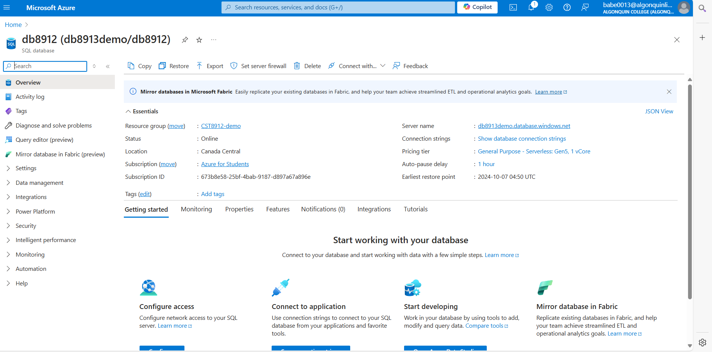
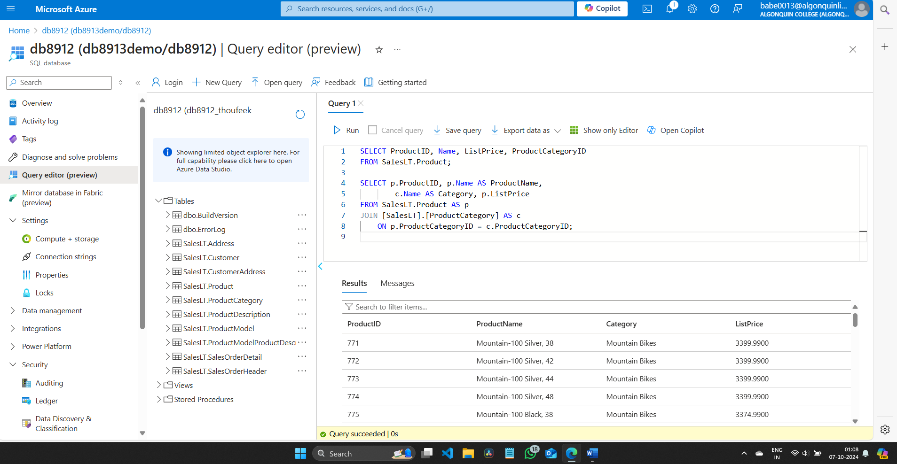
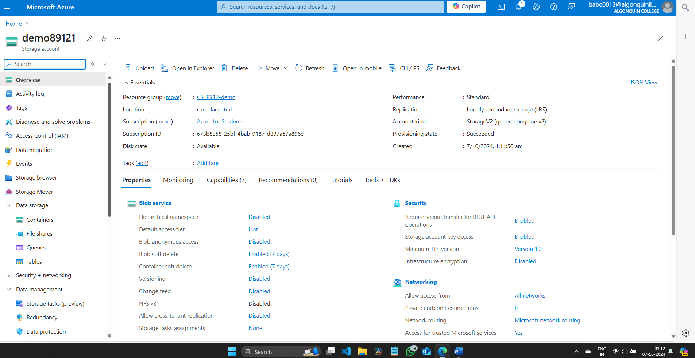
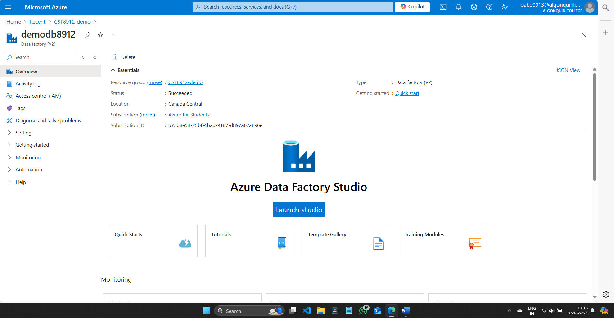
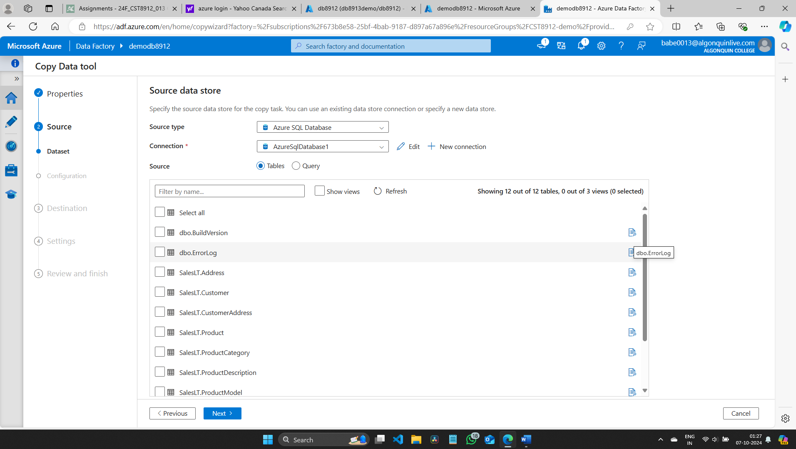
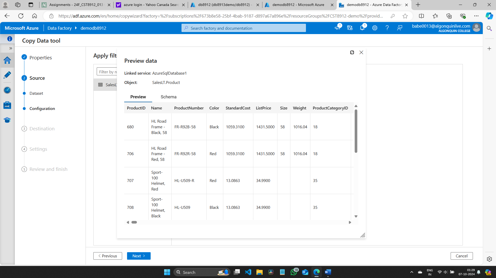
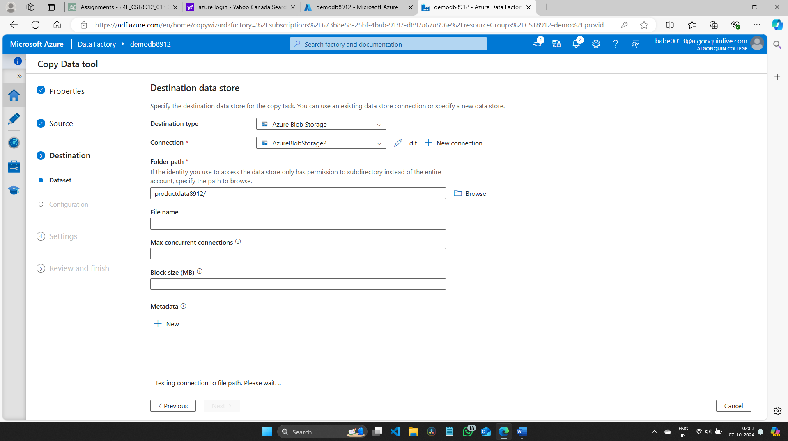
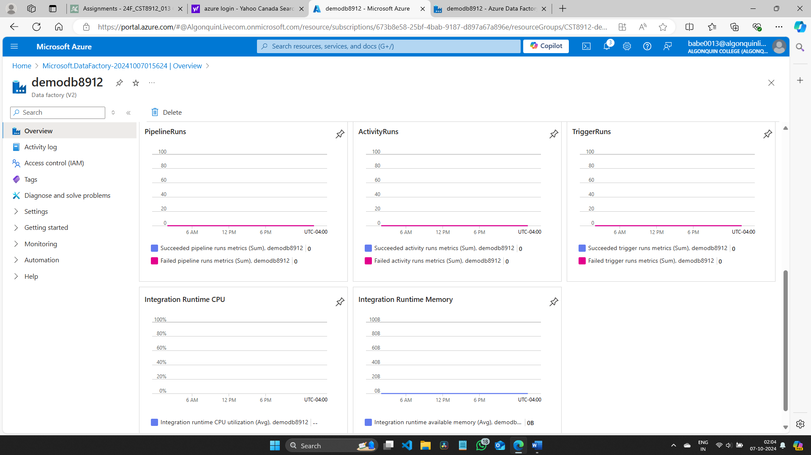
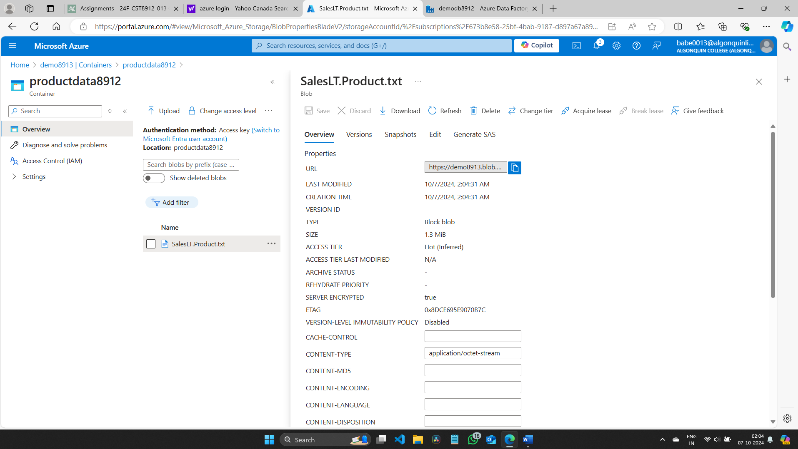
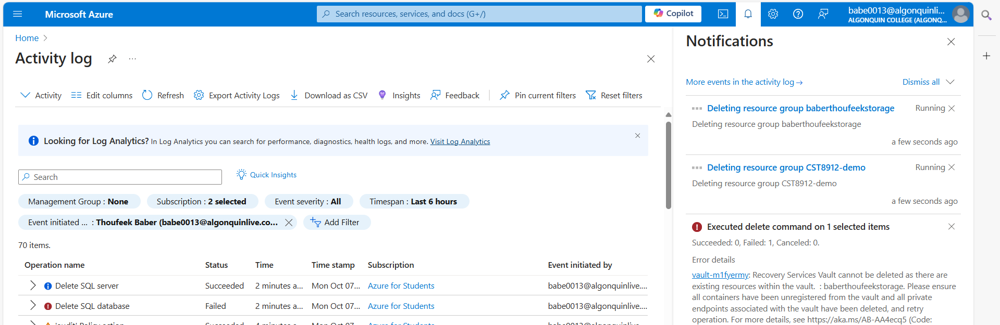

# CST8912_LAB4

---

# CST8912 – Cloud Solution Architecture: Graded Lab Activity #4

## Overview

This lab involves setting up an Azure SQL database, configuring access and network settings, integrating with Azure Data Factory, and copying data from a SQL database to Azure Blob Storage. It aims to provide hands-on experience with cloud database services, data integration workflows, and troubleshooting common challenges in cloud resource management.

### Key Objectives:

- Design cloud architecture layers to maximize reliability and resiliency.
- Outline architectural components to meet various application needs.
- Implement highly available and elastically scalable solutions using cloud service models.
- Explore the main features of a cloud SQL database in Azure.

---

## Steps to Complete the Lab

### 1. Configure Azure SQL Database

Set up the Azure SQL database in the Canada Central region under the `cst8912-demo` resource group:
- Database name: `db8912`
- SQL Server: `db8912demo`
- Authentication: SQL authentication with your username and password.
- Choose "No" for SQL elastic pool.
- Set "Workload environment" to Development.
- Backup storage redundancy: Locally-redundant storage.


*Figure 1: Overview of the resource group created.*

### 2. Configure Networking

On the "Create SQL Database" page:
- Select `Next: Networking >`.
- Choose `Public endpoint` for network connectivity.
- Enable access from both Azure services and your current client IP.


*Figure 2: overview info for SQL database.*

### 3. Enable Sample Data

In the "Additional Settings" tab, set the "Use existing data" option to `Sample`:
- This creates a sample database for exploration.
- Select `Review + Create`, then `Create`.


### 4. Query the Database

Sign in using the SQL admin credentials and open the Query editor:
- Run queries to explore the sample data.

```sql
SELECT ProductID, Name, ListPrice, ProductCategoryID
FROM SalesLT.Product;

SELECT p.ProductID, p.Name AS ProductName,
        c.Name AS Category, p.ListPrice
FROM SalesLT.Product AS p
JOIN [SalesLT].[ProductCategory] AS c
    ON p.ProductCategoryID = c.ProductCategoryID;
```


*Figure 3: Image shows the output for running the query inside the data.*

### 5. Create Azure Storage Account

Set up a storage account with default settings and create a container named `productdata8912`.


*Figure 4: Overview of the storage account created.*

### 6. Create and Configure Azure Data Factory

Deploy an Azure Data Factory and launch its studio:
- Choose to ingest data using a built-in copy task.
- Create connections to both Azure SQL Database and Azure Blob Storage.


*Figure 5: Image shows the setup of Azure Data Factory Service.*


### 7. Choose Task Type and Cadence

- In the Azure Data Factory Studio, select the task type as a **built-in copy task**.
- Set the task cadence to **“Run once now”**.


---

### 8. Configure Source Type for Azure SQL Database

- Choose **Azure SQL Database** from the source type dropdown.
- Create a new connection with the required configuration and **test the connection**.

> **Note**: This step establishes a connection between Azure SQL Database and Azure Data Factory.

> **Note**: Use the correct database name and password created earlier for the SQL database.


*Figure 9: Image shows the sample SQL data available inside the data factory.*


---

### 9. Select Source Table and Preview Data

- Select the source table as **SalesLT.Product** from the dropdown.
- Click **Next**, then preview the data to verify the selection.


*Figure 10: Preview of the sample data inside data factory.*

---

### 10. Configure Destination Type

- Click **Next**, and choose the destination type as **Azure Blob Storage** from the dropdown.


*Figure 12: Image shows the selection of Azure Blob Storage as the destination type.*

---

### 11. Create and Test Storage Account Connection

- Create a new connection to the storage account and **test the connection**.
- Choose the **folder path** and specify the **file name**.

> **Note**: Ensure you use the correct storage account name created during the lab.


---

### 12. Choose Configuration

- Finalize the configuration for the data copy task.


---

### 13. Review and Complete the Pipeline

- Review the pipeline settings, and click **Finish**.
- Navigate to the **storage account container** to verify that the **product CSV file** has been copied from the database to the storage account.


*Figure 15: Image shows the overview of the data factory with pipeline information, including run status.*

---

### 14. Verify Data in Storage Container

- Check the **productdata8912** container to confirm that the **SalesLT.Product** data has been transferred from the Azure SQL database.


*Figure 16: Image shows the productdata8912 container containing the SalesLT.Product data.*

---


### 15. Cleanup

Delete all resources created during the lab to avoid unnecessary charges.


*Figure 9: Image shows the deletion of all resources created for this lab project.*

---

## Lab Report Summary

### Introduction to SQL Database on Microsoft Azure

Throughout this lab, I explored the deployment, configuration, and management of SQL databases on Microsoft Azure. Using the Platform-as-a-Service (PaaS) model, the lab highlighted the benefits of automated management, scalability, and secure data access in cloud environments.

### Configuring Azure SQL Database

Key aspects included setting up a new database, managing access controls, and securing network connectivity. These steps emphasized the balance between database security and accessibility.

### Working with Azure Data Factory

I learned how to automate data integration workflows, transferring data between Azure SQL Database and Azure Blob Storage. This experience broadened my understanding of cloud-based data management.

### Challenges and Troubleshooting

The lab presented challenges like network configuration and service connectivity, enhancing my problem-solving skills. It solidified my confidence in handling similar cloud management tasks in the future.

### Conclusion

This lab deepened my understanding of managing cloud-based SQL databases and data integration workflows. The hands-on experience will be invaluable for future projects involving cloud solutions.

---

